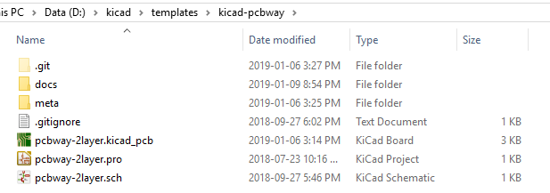
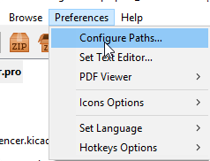
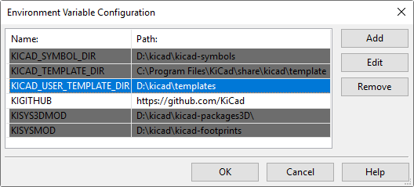
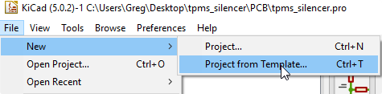
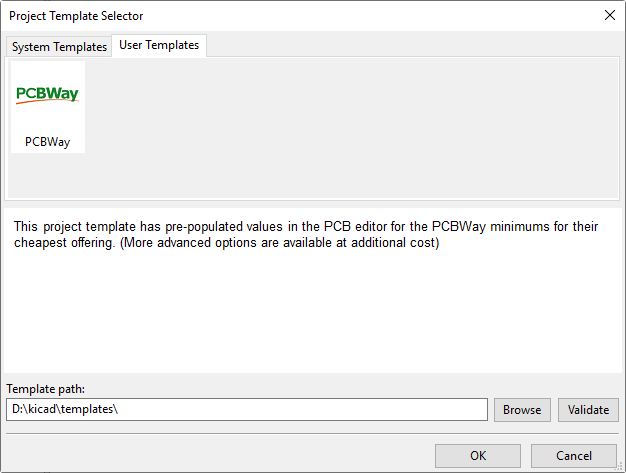

# How to use this KiCad template

## Step 1 - Clone the repository to a folder on your harddrive using git

## Step 2 - Configure Paths in KiCad

## Step 3 - Point to that template folder in the KiCad preferences

## Step 4 - Create a new project from template in KiCad

## Step 5 - Select the PCBWay template

## Step 6 - Design your project!

